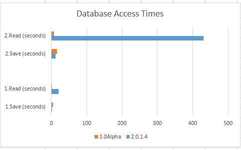
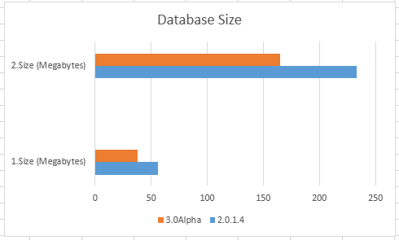

Quick Database Benchmark - 04/13/2018

This benchmark compares the database between Octopus V2.0.1.4 
and the current codebase.

## Charts ##

That is not an error. Octopus V2.0.1.4 takes over seven *minutes*
to read the database in Scenario 2!

### Scenario 1 ###

The database contains a single disc. 38,789 folders and 173,700 files.

### Scenario 2 ###

The database contains four discs. Total is 64,000+ folders, and
920,000+ files.

